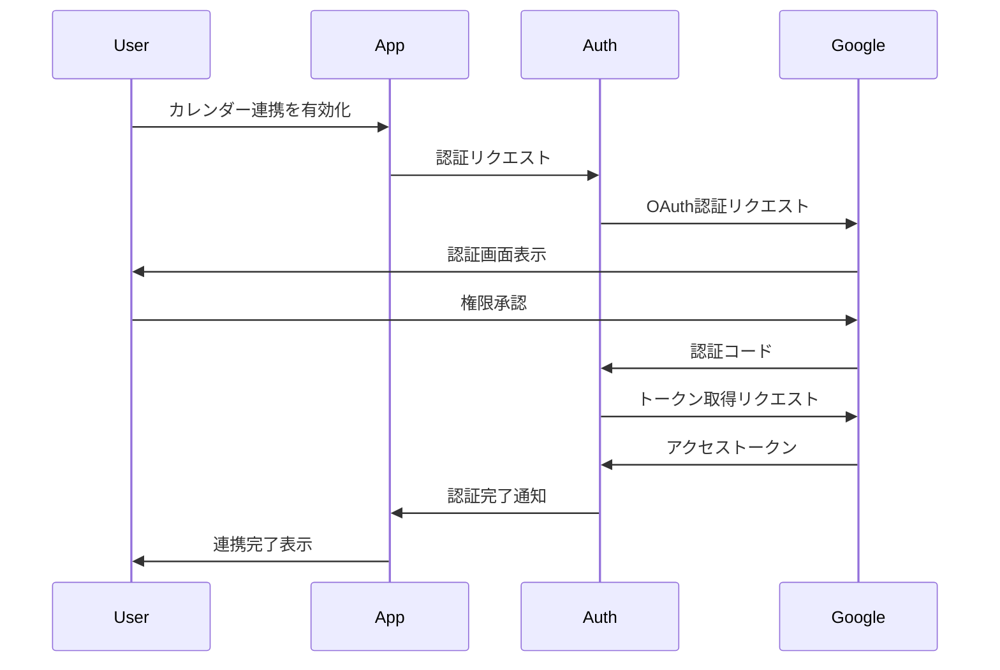
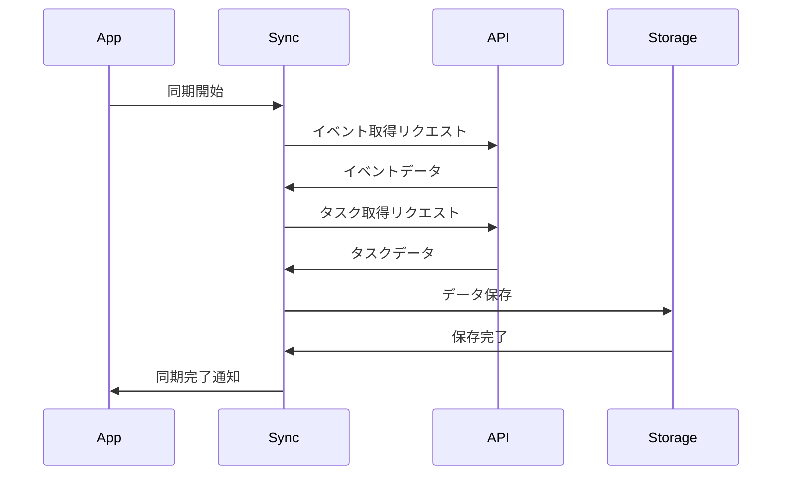

# Googleカレンダー連携機能 基本設計書

## 1. システム構成

### 1.1 全体構成
```
[StandByMyHeart App]
    │
    ├── [UI Layer]
    │   ├── CalendarView（カレンダー表示）
    │   ├── CalendarSettingsView（設定画面）
    │   └── SyncStatusIndicator（同期状態表示）
    │
    ├── [Domain Layer]
    │   ├── CalendarSyncService（同期サービス）
    │   ├── AuthenticationService（認証サービス）
    │   └── CalendarRepository（データアクセス）
    │
    └── [Infrastructure Layer]
        ├── GoogleCalendarAPI（Google APIクライアント）
        ├── LocalStorage（ローカルストレージ）
        └── SecurityManager（セキュリティ管理）
```

### 1.2 使用ライブラリ
- Google Calendar API Client Library
- OAuth 2.0 Client Library
- Secure Storage Library（トークン暗号化用）
- State Management Library（状態管理用）

## 2. クラス設計

### 2.1 UIコンポーネント

#### CalendarView
```typescript
class CalendarView {
  // プロパティ
  private calendarData: CalendarData;
  private syncStatus: SyncStatus;

  // メソッド
  public render(): void;
  public updateCalendar(data: CalendarData): void;
  public handleDateSelection(date: Date): void;
  private refreshCalendarData(): Promise<void>;
}
```

#### CalendarSettingsView
```typescript
class CalendarSettingsView {
  // プロパティ
  private syncEnabled: boolean;
  private accountInfo: GoogleAccountInfo;

  // メソッド
  public toggleSync(): Promise<void>;
  public disconnectAccount(): Promise<void>;
  public displayAccountInfo(): void;
}
```

### 2.2 ドメインサービス

#### CalendarSyncService
```typescript
class CalendarSyncService {
  // プロパティ
  private repository: CalendarRepository;
  private authService: AuthenticationService;

  // メソッド
  public async syncCalendarData(): Promise<void>;
  public async syncTasks(): Promise<void>;
  private handleSyncError(error: Error): void;
  private updateLastSyncTimestamp(): void;
}
```

#### AuthenticationService
```typescript
class AuthenticationService {
  // プロパティ
  private securityManager: SecurityManager;

  // メソッド
  public async authenticate(): Promise<void>;
  public async refreshToken(): Promise<void>;
  public isAuthenticated(): boolean;
  public revokeAccess(): Promise<void>;
}
```

### 2.3 インフラストラクチャ

#### GoogleCalendarAPI
```typescript
class GoogleCalendarAPI {
  // プロパティ
  private apiClient: GoogleAPIClient;

  // メソッド
  public async getEvents(timeRange: TimeRange): Promise<Event[]>;
  public async getTasks(): Promise<Task[]>;
  public async getCalendarSettings(): Promise<CalendarSettings>;
}
```

#### SecurityManager
```typescript
class SecurityManager {
  // メソッド
  public encryptToken(token: string): string;
  public decryptToken(encryptedToken: string): string;
  public secureStore(key: string, value: string): void;
  public secureRetrieve(key: string): string;
}
```

## 3. データフロー

### 3.1 認証フロー


### 3.2 同期フロー


## 4. インターフェース定義

### 4.1 データモデル

#### CalendarData
```typescript
interface CalendarData {
  events: Event[];
  tasks: Task[];
  lastSync: Date;
}

interface Event {
  id: string;
  title: string;
  startTime: Date;
  endTime: Date;
  description?: string;
  location?: string;
}

interface Task {
  id: string;
  title: string;
  dueDate?: Date;
  status: TaskStatus;
}
```

### 4.2 APIインターフェース
```typescript
interface CalendarAPIInterface {
  getEvents(params: GetEventsParams): Promise<Event[]>;
  getTasks(params: GetTasksParams): Promise<Task[]>;
  getSettings(): Promise<CalendarSettings>;
}

interface GetEventsParams {
  timeMin: string;
  timeMax: string;
  maxResults?: number;
}
```

## 5. エラーハンドリング実装方針

### 5.1 エラー種別と対応
```typescript
enum CalendarError {
  NETWORK_ERROR = 'NETWORK_ERROR',
  AUTH_ERROR = 'AUTH_ERROR',
  API_LIMIT_ERROR = 'API_LIMIT_ERROR',
  PERMISSION_ERROR = 'PERMISSION_ERROR'
}

interface ErrorHandler {
  handle(error: CalendarError): void;
  retry(): Promise<void>;
  fallbackToLocal(): void;
}
```

### 5.2 エラーリカバリー戦略
1. ネットワークエラー
   - 自動リトライ（最大3回）
   - オフラインモードへの切り替え
2. 認証エラー
   - トークンリフレッシュ
   - 再認証要求
3. API制限エラー
   - バックオフ戦略の実装
   - 同期間隔の調整

## 6. テスト方針

### 6.1 ユニットテスト
- 各クラスのメソッドの単体テスト
- モック/スタブを使用したAPI呼び出しのテスト
- エラーケースのテスト

### 6.2 結合テスト
- 認証フローの統合テスト
- 同期処理の統合テスト
- UIとバックエンドの結合テスト

### 6.3 E2Eテスト
- 実際のGoogleアカウントを使用したテスト
- エラーシナリオのテスト
- パフォーマンステスト

## 7. セキュリティ実装方針

### 7.1 トークン管理
```typescript
interface TokenManager {
  storeToken(token: Token): void;
  retrieveToken(): Token;
  refreshToken(): Promise<Token>;
  revokeToken(): Promise<void>;
}

interface Token {
  accessToken: string;
  refreshToken: string;
  expiresAt: Date;
}
```

### 7.2 データ暗号化
- AES-256暗号化の使用
- 安全なキー管理
- 暗号化データの適切な破棄

## 8. パフォーマンス最適化

### 8.1 同期の最適化
- 差分同期の実装
- バッチ処理の利用
- キャッシュ戦略の実装

### 8.2 データ取得の最適化
- ページネーションの実装
- 必要なデータのみの取得
- クライアントサイドキャッシュの活用
