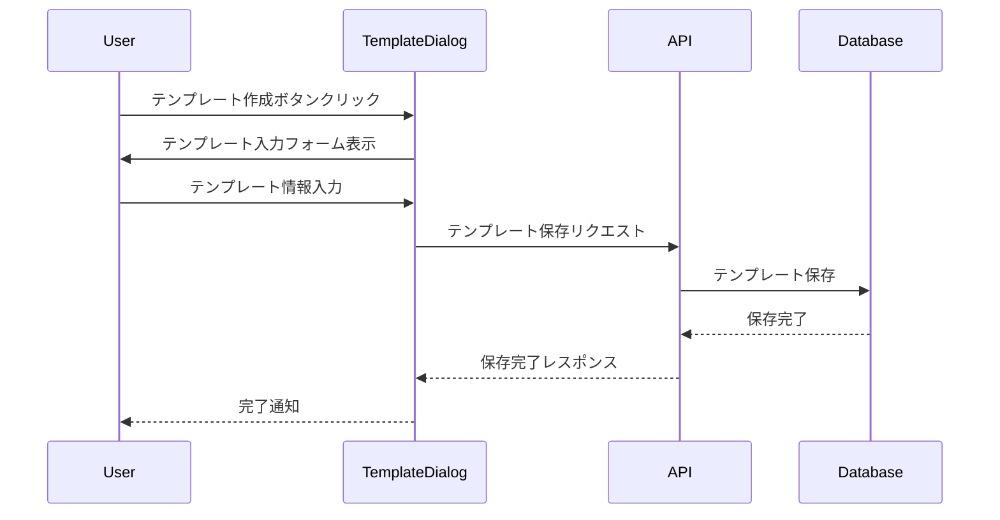
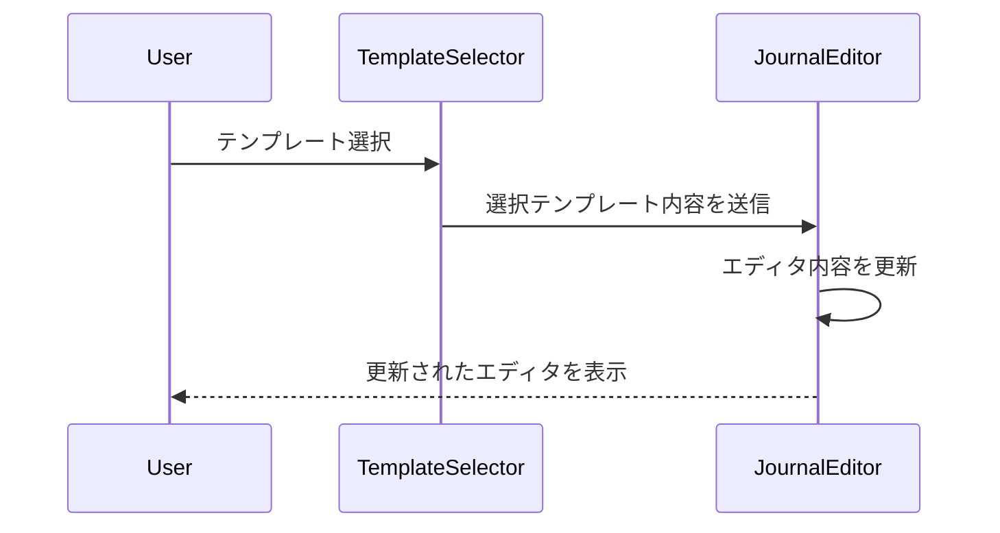

# 日記テンプレート機能 基本設計書

## 1. データベース設計

### テーブル設計

#### 1.1 journal_templates
```sql
CREATE TABLE journal_templates (
  id UUID PRIMARY KEY DEFAULT uuid_generate_v4(),
  user_id UUID NOT NULL REFERENCES auth.users(id),
  title VARCHAR(100) NOT NULL,
  content TEXT NOT NULL,
  created_at TIMESTAMP WITH TIME ZONE DEFAULT CURRENT_TIMESTAMP,
  updated_at TIMESTAMP WITH TIME ZONE DEFAULT CURRENT_TIMESTAMP,
  CONSTRAINT fk_user
    FOREIGN KEY(user_id)
    REFERENCES auth.users(id)
    ON DELETE CASCADE
);

CREATE INDEX idx_journal_templates_user_id ON journal_templates(user_id);
```

#### テーブル説明
- `id`: テンプレートの一意識別子
- `user_id`: テンプレート所有者のユーザーID（外部キー）
- `title`: テンプレートの名前
- `content`: テンプレートの内容
- `created_at`: 作成日時
- `updated_at`: 更新日時

### RLS（行レベルセキュリティ）ポリシー
```sql
-- 読み取りポリシー：自分のテンプレートのみ読み取り可能
CREATE POLICY "Users can view their own templates" ON journal_templates
  FOR SELECT USING (auth.uid() = user_id);

-- 作成ポリシー：認証済みユーザーのみ作成可能
CREATE POLICY "Users can create their own templates" ON journal_templates
  FOR INSERT WITH CHECK (auth.uid() = user_id);

-- 更新ポリシー：自分のテンプレートのみ更新可能
CREATE POLICY "Users can update their own templates" ON journal_templates
  FOR UPDATE USING (auth.uid() = user_id);

-- 削除ポリシー：自分のテンプレートのみ削除可能
CREATE POLICY "Users can delete their own templates" ON journal_templates
  FOR DELETE USING (auth.uid() = user_id);
```

## 2. コンポーネント設計

### 2.1 コンポーネント構成

```
components/
  journal/
    ├── TemplateDialog/
    │   ├── index.tsx        # テンプレート作成/編集ダイアログ
    │   └── styles.ts        # スタイル定義
    ├── TemplateSelector/
    │   ├── index.tsx        # テンプレート選択コンポーネント
    │   └── styles.ts        # スタイル定義
    └── JournalEditor/
        ├── index.tsx        # 日記エディタコンポーネント
        └── styles.ts        # スタイル定義
```

### 2.2 各コンポーネントの責務

#### TemplateDialog
- テンプレートの作成・編集フォームを提供
- バリデーション処理
- 保存処理の実行

#### TemplateSelector
- 利用可能なテンプレート一覧の表示
- テンプレートの選択機能
- 選択されたテンプレートの内容をJournalEditorに反映

#### JournalEditor
- 日記本文の編集機能
- テンプレート内容の適用
- 自動保存機能（設定に応じて）

## 3. 状態管理と処理フロー

### 3.1 状態管理

```typescript
interface TemplateState {
  templates: JournalTemplate[];
  selectedTemplate: JournalTemplate | null;
  isLoading: boolean;
  error: Error | null;
}
```

### 3.2 主要な処理フロー

1. テンプレート作成フロー


2. テンプレート適用フロー


## 4. APIエンドポイント

### 4.1 テンプレート操作API

```typescript
// テンプレート作成
POST /api/journal/templates
Request:
{
  title: string;
  content: string;
}

// テンプレート一覧取得
GET /api/journal/templates

// テンプレート更新
PUT /api/journal/templates/:id
Request:
{
  title?: string;
  content?: string;
}

// テンプレート削除
DELETE /api/journal/templates/:id
```

## 5. エラーハンドリング

### 5.1 想定されるエラーケース
1. テンプレート作成/更新時のバリデーションエラー
2. ネットワークエラー
3. 権限エラー
4. データベースエラー

### 5.2 エラーメッセージ定義
```typescript
const ERROR_MESSAGES = {
  TEMPLATE_CREATE_FAILED: 'テンプレートの作成に失敗しました',
  TEMPLATE_UPDATE_FAILED: 'テンプレートの更新に失敗しました',
  TEMPLATE_DELETE_FAILED: 'テンプレートの削除に失敗しました',
  NETWORK_ERROR: 'ネットワークエラーが発生しました',
  PERMISSION_DENIED: 'この操作を行う権限がありません',
} as const;
```

## 6. セキュリティ考慮事項

1. RLSによるデータアクセス制御
2. 入力値のバリデーション
3. XSS対策
4. CSRF対策
