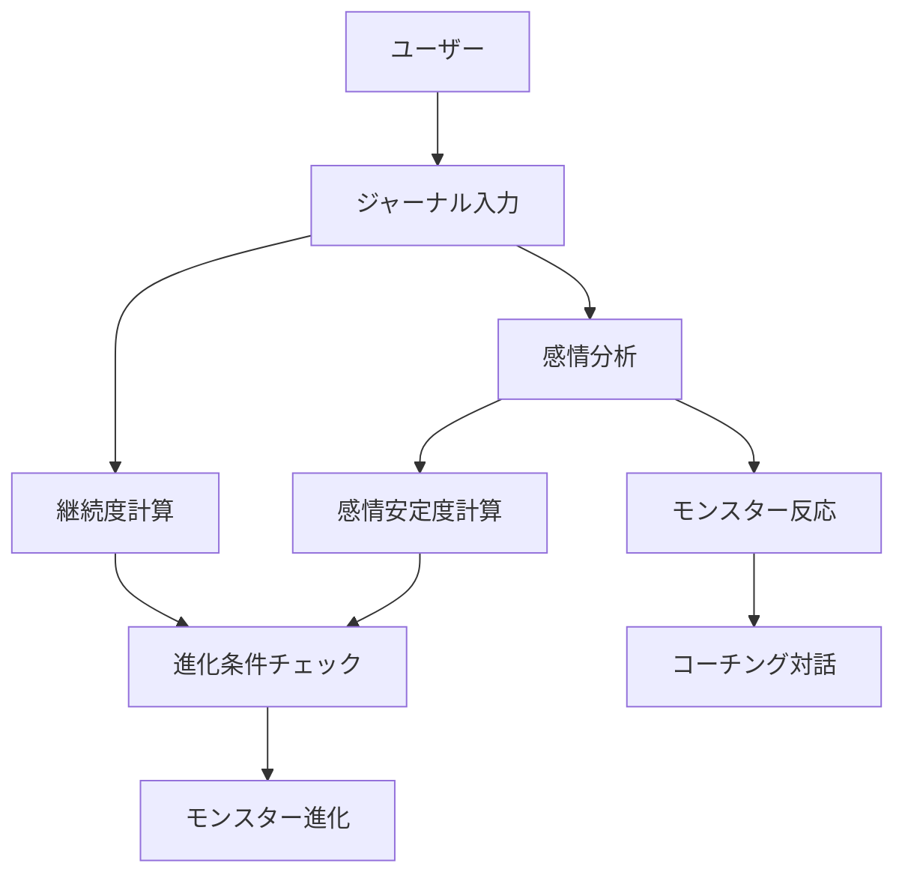
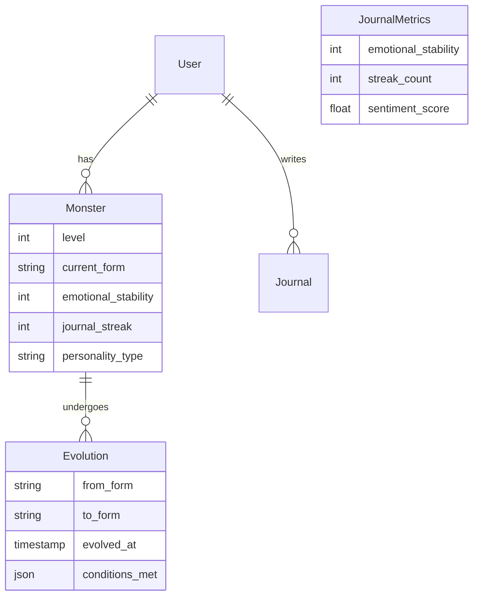
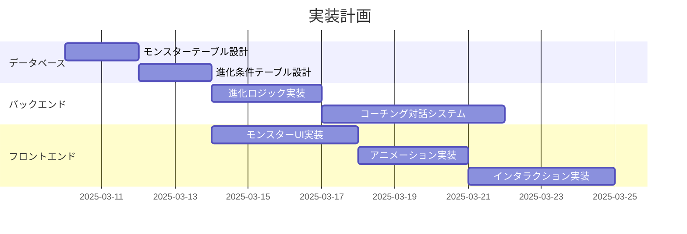

# AIコーチングモンスター仕様書

## 概要
ユーザーの感情状態やジャーナル活動に応じて進化するデジタルモンスターとの対話型コーチングシステム。

## システム構成図

## データモデル

## 主要機能

### 1. モンスター育成システム

#### 進化ステージ
- 初期形態：卵
- 進化条件：
  - ジャーナル継続日数（7日、30日、100日など）
  - 感情安定度スコア
  - 目標達成度

#### 成長指標
- ジャーナル執筆の継続度
- 感情の安定性
- 設定した目標の達成状況

### 2. インタラクティブUI

#### モンスター表示
- 画面上を左右に動くアニメーション
- 感情状態に応じた表情変化
- クリック/タップによるインタラクション

#### 対話インターフェース
- 吹き出し形式のメッセージ表示
- アニメーションによる感情表現
- タッチ操作への反応

### 3. コーチング対話システム

#### 対話機能
- ユーザーの感情状態に基づく応答生成
- 進化段階に応じた異なるコーチングスタイル
- パーソナライズされたアドバイスと励まし

#### パーソナライゼーション
- ユーザーの過去の行動パターンの学習
- 感情の変化に応じた適応的な対応
- 個人の目標に合わせたガイダンス

## 技術要件

### フロントエンド
- Framer Motion：アニメーション実装
- SVG/Canvas：キャラクターグラフィックス
- React：UIコンポーネント

### バックエンド
- GPT-4 API：対話生成
- 感情分析API：テキスト解析
- 進化ロジック処理システム

## 実装スケジュール

## 次のステップ
1. データベーススキーマの詳細設計
2. モンスターのキャラクターデザイン
3. 進化条件の具体的な数値設定
4. コーチング対話のパターン設計